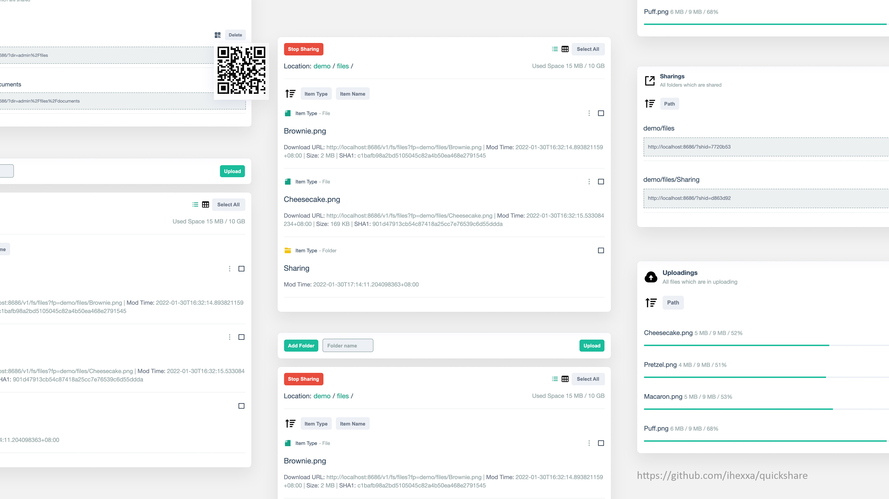

<h1 align="center">
  Quickshare
</h1>
<p align="center">
  Quick and simple file sharing between different devices.
  (<a href="https://github.com/ihexxa/quickshare/blob/main/docs/screenshots.md">Screenshots</a>)
</p>
<p align="center">
  <a href="https://github.com/ihexxa/quickshare/actions">
    
  </a>
  <a href="https://goreportcard.com/report/github.com/ihexxa/quickshare">
    
  </a>
  <a href="https://gitter.im/quickshare/Lobby?utm_source=share-link&utm_medium=link&utm_campaign=share-link">
    
  </a>
<p>

## Try it yourself

This is a [demo on Heroku](https://hexxa-quickshare.herokuapp.com/).

(User is `demo`, password is `Quicksh@re`, uploading/downloading speed is limited to around 100KB.)

[](https://heroku.com/deploy?template=https://github.com/ihexxa/quickshare)




English | [简体中文](./docs/README_zh-cn.md)

## Features

- File Management
  - Support uploading, downloading, creating, deleting and moving files and folders
  - Resumable uploading and downloading
  - Manage files and folders in browser
  - Search files and folders with multiple keywords in seconds
  - Share directories to others, including anonymous
  - Scan QR codes to visit sharing folders
  - Upload hundreds of files at once
  - Steaming uploading: make it work behind CDN or reverse proxy
  - Files can also be managed from OS
- User Management
  - Support multiple users
  - Each user has a role (user/admin)
  - User home directory
  - Per-user download & upload speed limiting
  - Per-user space quota
- MISC
  - Adaptive UI
  - I18n support
  - Wallpaper customization
  - Cross-platform: support Linux, Mac and Windows

## Quick Start

### Run in Docker (Recommended)

Following will start a `quickshare` docker and listen to `8686` port.

Then you can open `http://127.0.0.1:8686` and log in with user name `qs` and password `1234`:

```
docker run \
--name quickshare \
-d -p 8686:8686 \
-v `pwd`/quickshare/root:/quickshare/root \
-e DEFAULTADMIN=qs \
-e DEFAULTADMINPWD=1234 \
hexxa/quickshare
```

- `DEFAULTADMIN` is the default user name
- `DEFAULTADMINPWD` is the default user password
- `/quickshare/root` is where the Quickshare stores files and directories.
- Please refer to [this doc](./docs/doc.md) if you want to manage files and folders from OS.

### Run from source code

Before start, please confirm that Go/Golang (>=1.17), Node.js and Yarn are installed on your machine.

```
# clone this repo
git clone git@github.com:ihexxa/quickshare.git

# go to repo's folder
cd quickshare

DEFAULTADMIN=qs DEFAULTADMINPWD=1234 yarn start
```

OK! Open `http://127.0.0.1:8686` in browser, and log in with user name `qs` and password `1234`.

### Run executable file

- **Downloading**: Download last distribution(s) in [Release Page](https://github.com/ihexxa/quickshare/releases).
- **Unzipping**: Unzip it and run following command `DEFAULTADMIN=qs DEFAULTADMINPWD=1234 ./quickshare`. (You may update its execution permission: e.g. run `chmod u+x quickshare`)
- **Accessing**: At last, open `http://127.0.0.1:8686` in browser, and log in with user name `qs` and password `1234`.

### FAQ

Coming soon.
