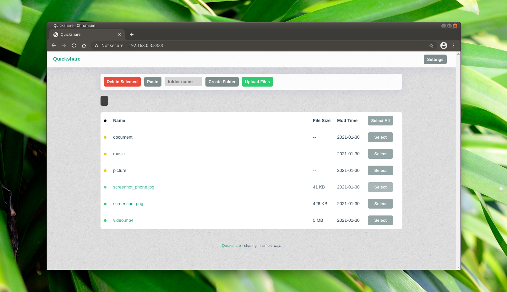
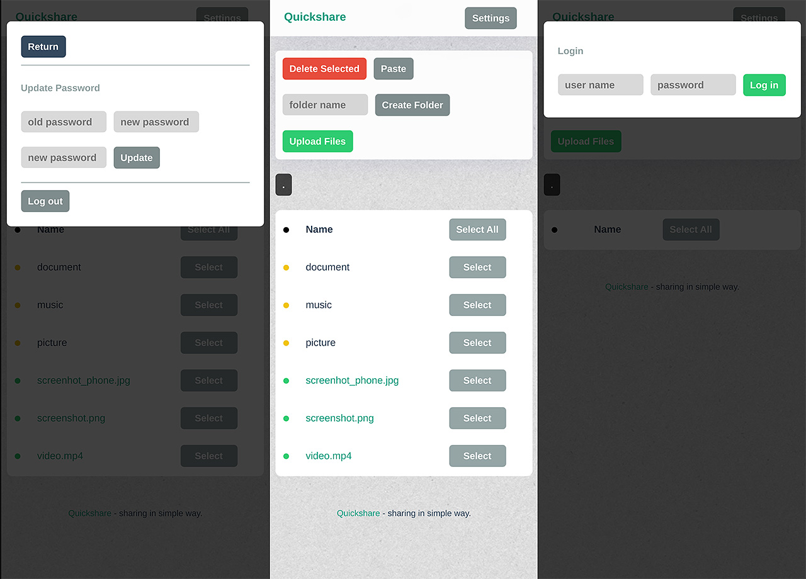

<h1 align="center">
  Quickshare
</h1>
<p align="center">
  简单的文件共享服务, 使用Go/Golang, Typescript, Gin, React, Boltdb等构建.
</p>
<p align="center">
  <a href="https://github.com/ihexxa/quickshare/actions">
    
  </a>
  <a href="https://goreportcard.com/report/github.com/ihexxa/quickshare">
    
  </a>
  <a href="https://gitter.im/quickshare/Lobby?utm_source=share-link&utm_medium=link&utm_campaign=share-link">
    
  </a>
<p>





选择语言: [English](../README.md) | 简体中文

## 主要功能

- 在多个设备之间共享文件 (自适应 UI)
- 兼容 Linux, Mac 和 Windows
- 上传下载都支持断点续传
- 在 Web 浏览器 中完成上传下载

## 快速开始

**下载**: 先下载最新版本 [发布页](https://github.com/ihexxa/quickshare/releases).

**解压**: 将其解压, 并在运行命令 `./quickshare`. (你可能需要为它更新执行权限: 比如在 linux 上执行 `chmod u+x quickshare`)

**运行**: 在第一次运行时, Quickshare 会让你输入你的用户名 (这里输入的用户名是 quickshare), 并会为你生成密码. 它可能会输出类似下面内容 (这里密码是`2fdc98`):

```
Please input admin name: quickshare
password is generated: 2fdc98, please update it after login
user (quickshare) is created
```

**访问**: 最后, 打开你的浏览器并访问 `http://127.0.0.1:8686`.

### 常见问题

敬请期待.
