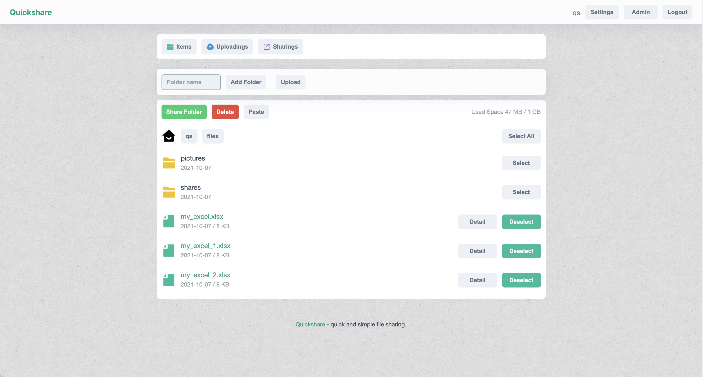

<h1 align="center">
  Quickshare
</h1>
<p align="center">
  简单的文件共享服务, 使用Go/Golang, Typescript, Gin, React, Boltdb等构建.
</p>
<p align="center">
  <a href="https://github.com/ihexxa/quickshare/actions">
    
  </a>
  <a href="https://goreportcard.com/report/github.com/ihexxa/quickshare">
    
  </a>
  <a href="https://gitter.im/quickshare/Lobby?utm_source=share-link&utm_medium=link&utm_campaign=share-link">
    
  </a>
<p>

这是一个 [Heroku上的演示](https://hexxa-quickshare.herokuapp.com/).

(用户名是 `demo`, 密码是 `Quicksh@re`, 上传/下载速度被限制在大约100KB.)



选择语言: [English](../README.md) | 简体中文

## 主要功能

- 文件管理
  - 无需客户端
  - 无文件大小限制
  - 上传下载的断点续传
  - 将目录共享他人
  - 一次上传上百个文件
  - 流式上传: 使它可工作在 CDN 或 反向代理 之后
  - 也可通过操作系统管理文件
- 用户管理
  - 支持多用户
  - 用户home目录
  - 用户级别的上传下载速度限制
  - 用户级别的空间限制
- 其他
  - 自适应UI
  - 跨平台: 支持Linux, Mac and Windows
## 快速开始

### 通过Docker运行 (推荐)

下面会启动一个 `quickshare` docker 并监听 `8686` 端口.

然后你可以打开 `http://127.0.0.1:8686` 并且使用用户名 `qs` 和 密码 `1234` 登入.

```
docker run \
--name quickshare \
-d -p 8686:8686 \
-v `pwd`/quickshare/root:/quickshare/root \
-e DEFAULTADMIN=qs \
-e DEFAULTADMINPWD=1234 \
hexxa/quickshare
```

- `DEFAULTADMIN` 是默认的用户名
- `DEFAULTADMINPWD` 是默认的用户密码
- `/quickshare/root` 是 Quickshare 保存文件和目录的地方.

### 运行源代码

在开始之前, 请确认 Go/Golang (>=1.15), Node.js 和 Yarn 已经安装在您的机器.

```
# clone this repo
git clone git@github.com:ihexxa/quickshare.git

# go to repo's folder
cd quickshare

DEFAULTADMIN=qs DEFAULTADMINPWD=1234 yarn start
```

OK! 在浏览器中打开 `http://127.0.0.1:8686`, 并且使用用户名 `qs` 和 密码 `1234` 登入.

### 运行可执行文件

- **下载**: 下载最新的可执行文件 [Release Page](https://github.com/ihexxa/quickshare/releases).
- **解压**: 解压并执行 `DEFAULTADMIN=qs DEFAULTADMINPWD=1234 ./quickshare`. (你可能需要更新它的执行权限, 比如运行 `chmod u+x quickshare`)
- **访问**: 最后, 打开 `http://127.0.0.1:8686`, 并且使用用户名 `qs` 和 密码 `1234` 登入.

### 常见问题

Coming soon.
